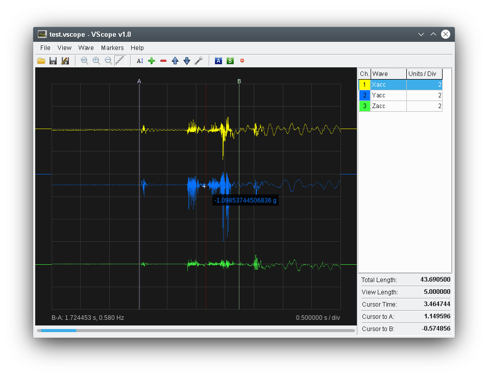

# VScope: Multi-Wave Oscilloscope Data Visualiser

This GUI Application can be used to visualize multiple Waveforms that can contain high amount of samples. For the waveform visualization OpenGL drawing is used with strong usage of alpha blending. It still works nice when displaying 10 Million sample points.

## Screenshot


## Minimalistic Data Format

A minimal VScope JSON file look like this:
```
{
	"WAVES": [
		{
			"NAME": "Wave1",
			"SAMPLT": 0.00025,
			"VALUES": "1.2|1.0|1.04|1.43E2|1.22E-2",
			"STARTT": 0,
			"DATAUNIT": "m"
		},
		{
			"NAME": "Wave2",
			"SAMPLT": 0.00025,
			"VALUES": "0.2|0.3|1.0E2|0.002|0.021",
			"STARTT": 0,
			"DATAUNIT": "A"
		}
	]
}
```

All time units are given in seconds.
The single VALUES field stores all the wave data in string format, where the samples are floating point values separated by the "|" (pipe) character. This format was chosen in order not to overload the JSON parsers creating huge amount of data nodes. (The VSCope uses a special, optimized parser to parse the VALUE field). In python you can use ```'|'.join(value_array)``` to have a better performance creating the VALUES field.

## Additional Data Fields
There are some more additional data in the VSCope data files. A more complete file looks like this: 
```
{
	"VIEW": {
		"TIMEDIV": 1,
		"VIEWSTART": 1.28412621443668
	},
	"MARKERS": [
		{
			"VISIBLE": true,
			"MTIME": 2.3151481122469
		},
		{
			"VISIBLE": true,
			"MTIME": 4.03960066699143
		}
	],
	"WAVES": [
		{
			"NAME": "Wave1",
			"SAMPLT": 0.00025,
			"VALUES": "1.2|1.0|1.04|1.43E2|1.22E-2",
			"STARTT": 0,
			"DATAUNIT": "m",			
			"COLOR": 4278255615,
			"ALPHA": 0.5,
			"VIEWSCALE": 0.5,
			"VIEWOFFSET": 3
		},
		{
			"NAME": "Wave2",
			"SAMPLT": 0.00025,
			"VALUES": "0.2|0.3|1.0E2|0.002|0.021",
			"STARTT": 0,
			"DATAUNIT": "A",
			"COLOR": 4294734599,
			"ALPHA": 0.5,
			"VIEWSCALE": 0.5,
			"VIEWOFFSET": 1
		}
	]
}
```

